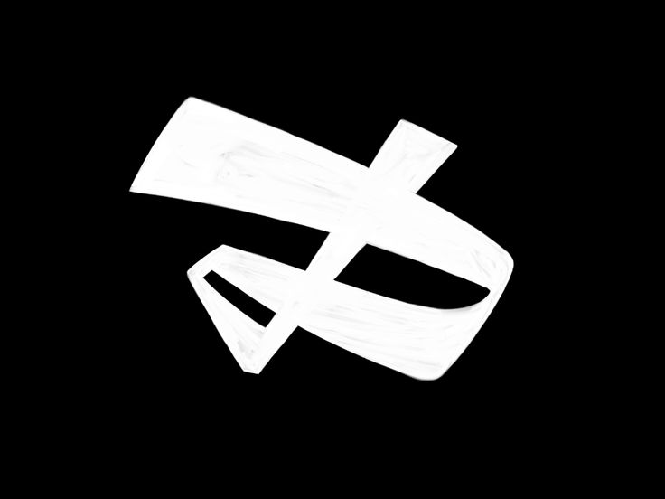

<a name="readme-top">

<br/>

<br />
<div align="center">
  <a href="https://github.com/zyx-0314/">
  <!-- TODO: If you want to add logo or banner you can add it here -->
   
  </a>
<!-- TODO: Change Title to the name of the title of your Project -->
  <h3 align="center">HANDS ON 2</h3>
</div>
<!-- TODO: Make a short description -->
<h3 align="center">MY FAV HEROES</h3>
<div align="center">
</div>

<br />

<!-- TODO: Change the zyx-0314 into your github username  -->
<!-- TODO: Change the WD-Template-Project into the same name of your folder -->


---

<br />
<br />

<!-- TODO: If you want to add more layers for your readme -->
<details>
  <summary>Table of Contents</summary>
  <ol>
    <li>
      <a href="#overview">Overview</a>
      <ol>
        <li>
          <a href="#key-components">Key Components</a>
        </li>
        <li>
          <a href="#technology">Technology used are html and css</a>
        </li>
      </ol>
    </li>
    <li>
      <a href="#rule,-practices-and-principles">Rules, Practices and Principles</a>
    </li>
    <li>
      <a href="#resources">Resources</a>
    </li>
  </ol>
</details>

---

Anime Hero Galleries

>> Project Description
Anime Hero Galleries is a visually captivating website that showcases a collection of iconic anime heroes. Each hero is presented with detailed information and stunning images, offering fans a delightful browsing experience. The website features a unique design with engaging animations, enhancing the overall user interaction.

>> Navigation and Usage Instructions:
Home Page:

Access the home page by clicking the "Home" button in the navigation bar.
The home page provides an overview of the website and highlights featured heroes.
Hero Pages:

Navigate to individual hero pages by clicking on the respective buttons (Hero 1, Hero 2, etc.) in the navigation bar.
Each hero page contains detailed information about the hero, including their background, abilities, and significant appearances.
Enjoy animations and interactive elements as you explore the content.
Card Gallery:

Visit the Card Gallery by clicking the "Card Gallery" button in the navigation bar.
The gallery showcases various anime heroes in a card layout, with hover animations for an enhanced viewing experience.

>> Footer:

The footer includes social media links (Facebook, Twitter, Instagram) for further engagement.
Contact information is provided for any inquiries or feedback.

## Rules, Practices and Principles
1. Always use `WD-` in the front of the Title of the Project for the Subject followed by your custom naming.
2. Do not rename any .html files; always use `index.html` as the filename.
3. Place Files in their respective folders.
4. All file naming are in camel case.
   - Camel case is naming format where there is no white space in separation of each words, the first word is in all lower case while the succeding words first letter are in upper followed by lower cased letters.
   - ex.: buttonAnimatedStyle.css
5. Use only `External CSS`.
6. Renaming of Pages folder names are a must, and relates to what it is doing or data it holding.
7. File Structure to follow below.

```
WD-ProjectName
└─ assets
|   └─ css
|   |   └─ style.css
|   └─ img
|   |   └─ fileWith.jpeg/.jpg/.webp/.png
|   └─ js
|       └─ script.js
└─ pages
|  └─ pageName
|     └─ assets
|     |  └─ css
|     |  |  └─ style.css
|     |  └─ img
|     |  |  └─ fileWith.jpeg/.jpg/.webp/.png
|     |  └─ js
|     |     └─ script.js
|     └─ index.html
└─ index.html
└─ readme.md
```

## Resources

<!-- TODO: Add References -->
References and Resources
Title	| Purpose	| Link
Roboto Slab	| Font for header and main content	| Roboto Slab
Open Sans	| Font for secondary content	| Open Sans
Oswald	| Font for headings and titles	| Oswald

Images:
Background images and hero images sourced from various anime databases and fan sites.
